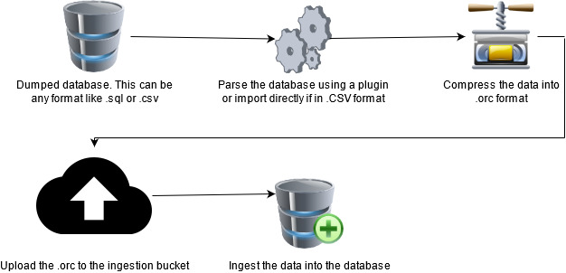
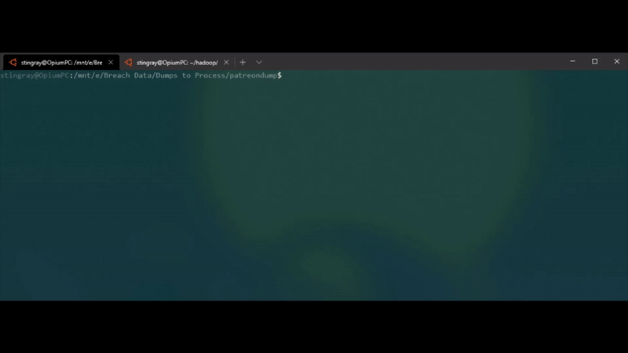
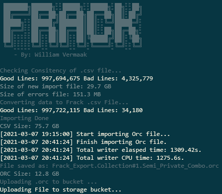
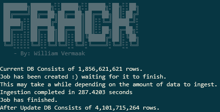
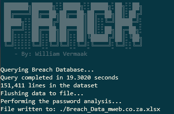

## What is Frack?

Frack is my attempt at creating an end-to-end solution to store, manage and query your breach data. The tool has got a very basic workflow making it easy to use.

## Why Frack?

Well, I wanted something that was easy to use, didn’t cost millions of dollars and was quick. The python is easy to read and understand so hopefully you will get a better understanding of interacting with your database using python while learning about all the awesome cloud stuff that’s available.

## Let’s get into it.
Frack has been updated to use custom plugins to make it easier to parse raw breach data. The SHA-1 hashes of the breach files will be posted on the [Plugins](/media/Plugins.md) page to make it easy to find the correct plugin for your dataset. These plugins will be updated as new breaches are released. If you feel like contributing, you are more than welcome to add your own parsers.

Should you have a breach that is not supported by a plugin, you can still manually parse the file if you can get in one of the following .csv formats.

Frack supports these .csv file formats:

* `<email>,<password>`
* `<email>,<hash>`
* `<email>,<hash>,<salt>`

Unfortunately, the breach data available on the internet is never clean, and has to be extracted manually to ensure quality of the data. An example of extracting the data from a .sql dump can be seen below. I’m using an awk script to break down the .sql file into .csv files for each table and then a .sql file containing the structure of the .csv file. The awk script I use in this video is by: [https://gist.github.com/slawo-ch/894349427655d22398f825dc535a40f0](https://gist.github.com/slawo-ch/894349427655d22398f825dc535a40f0)

Once you’ve got a clean .csv file, you can use the parsing module to add fields to the .csv file to make the data make sense when viewed in the database. The converted format looks like this:

`breach:string,site:string,year:int,domain:string,email:string,password:string,hash:string,salt:string`

Because we’re adding a lot of data to the .csv the file will grow substantially which is why we then convert it to .orc format. To learn more about the .orc format you can visit: [https://orc.apache.org/](https://orc.apache.org/)

As you can see below, the .orc file is super compressed, so it fits in perfectly with the why, to not spend your whole year’s salary on bandwidth.

Here you can see how effective .orc is at compressing data. I threw a kitchen sink at it and it managed to parse it perfectly. Our input file was 29.7GB, then after adding our fields it was 75.7GB then after converting to .orc it’s a mere 12.8GB. That’s smaller than the original, and we’re adding 1 billion lines to our DB.

Now let’s go through the modules. The tool consists of three modules. A query module to query your data, a db module to manage your database and get some pretty cool info from your db and finally the parse module to do the whole conversion process explained above.

## The Parse Module:

This module’s sole purpose is to first clean up the data by performing these checks:

- The fields must equal that of the selected input. This is two fields for `<email>,<password>` and `<email>,<hash>` and then three fields for `<email>,<hash>,<salt>`.
- Validate that the e-mail address is valid by using some RegEx.
- Do some rubbish removal of lines with blank fields and non-ascii characters.
- Check that the hash is longer than 16 chars. If it's shorter it's probably trash.

The parse module now supports plugins. This will allow importing of a raw dump no matter what format it was dumped in to be parsed into Frack format alleviating the pain associated with extracting the data into a clean usable dataset. To see if your breach is supported by a plugin you can search for the SHA-1 of the file on the [Plugins](/media/Plugins.md) page.

The parse module has got several arguments. The default input file format is `<email>,<hash>`. If your file differs, you need to use flags to specify what data your file contains.
|Argument|What it does|
|--|--|
| -i / --inputfile `<file>`| File to import data from. This is your cleaned .csv file.|
| -m / --module `<module name>` | Use a plugin module to import a raw breach. |
| -y / --year `<year>`| The year the breach / combo / collection was released. |
| -n / --name `<name>`| The name of the breach / combo / collection. |
| -w / --website `<website>`| The website address of the site in question. |
| -p / --passwords | Use this flag if the file being imported contains passwords i.e. `<email>,<password>`|
| -s / --salt | Use this flag if the file contains salt values i.e. `<email>,<hash>,<salt>`.|
| -d / --nodel | Don't delete the .error file. During parsing all fields that does not comply with the rules above will be dumped into a .error file for further analysis. |
| -u / --upload | When parsing is done, upload the .orc file to the ingestion bucket. |

## The db module:

The db module is used for managing the data, and includes some cool stats for your dataset.

|Argument|What it does|
|--|--|
| -c / --count | Count the lines in the database. |
| -n / --nomnom | Create and start an ingestion job for all the files in your storage bucket. |
| -d / --delete | Adding this flag, the ingestion bucket will be emptied once everything has been ingested. |
| -t / --top `<n>`| Displays the top `<n>` passwords from the whole dataset. |
| -w / --web | Display all the websites with line counts that's currently in your database. |
| -b / --breach | Display all the breaches with their line counts that's in the current database. |
| -f / --file | Save the output of any of the queries above to an Excel sheet. |

## The query module:

The query module allows you to query the dataset for domains. The output will be in Excel and include a quick password analysis and a list of all the unique passwords for the domain you’ve queried.

|Argument|What it does|
|--|--|
| -i / --inputfile `<filename>`  | Specify a file containing all the domains you wish to query. One domain per line. |
| -d / --singledomain `<domain>` | Specify a single domain to query. |

# Quick guided run through
1. [Configuring your local and Cloud infrastructure.](/media/Step1.md)
2. [Converting and Ingesting your first data.](/media/Step2.md)
3. [Converting and Ingesting using a plugin.](/media/Step3.md)

## License
`Frack` is licensed under a [GNU General Public v3 License](https://www.gnu.org/licenses/gpl-3.0.en.html). Permissions beyond the scope of this license may be available at [http://sensepost.com/contact/](http://sensepost.com/contact/).