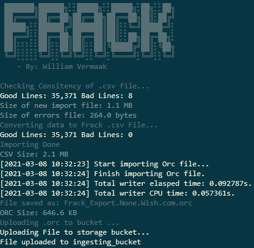

# Step 2 - Ingesting your first data

Now that you have got your cloud infra set up, let’s ingest your first data set.
First export your admin key path using below command:

`export GOOGLE_APPLICATION_CREDENTIALS=/home/stingray/<your admin key>.json`

I’ve included a small sample in the demo directory. The file is in `<email>:<password>` format, so we just quickly need to replace the colons with commas to make it a valid .csv file.

`sed "s/:/,/g" -i 35k_Wish.com_2021_Stranded.txt`

Now that our file is ready for parsing, you can run it through Frack using the command below:

`./frack.py parse -p -y 2021 -n None -w Wish.com -d -u -i 35k_Wish.com_2021_Stranded.txt`

| Argument | Meaning |
|---|---|
|parse|	The first parameter is the module to use. We will be using the parse module. |
|-p| Our file contains passwords |
|-y|The year the breach happened |
|-n|The Name of the breach. Since this is just a single website and not part of a combo or a collection of breaches, I prefer to use None.|
|-w|The website that the data relates to|
|-d|I don’t want to delete the .error file. All errors found while parsing will be flushed to a .error file for further analysis.|
|-u|After parsing and conversion, upload the file to our storage bucket.|
|-i|The input file name.|

And you should get an output similar to below:

Now to ingest the file into the database, run below:

`./frack.py db -n`

| Argument | Meaning |
|---|---|
|db|We will be using the db module since we’re talking to the db.|
|-n|Trigger the ingestion and import the files into your new database.|

The file will be ingested. Note that it may take a while if you ingest massive data sets.

