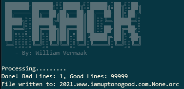

# Step 3 - Converting and Ingesting using a plugin.

To ingest the SQL sample, first export your admin key path using below command:

`export GOOGLE_APPLICATION_CREDENTIALS=/home/stingray/<your admin key>.json`

The demo file is in the demo directory called fake.sql.
I have created a plugin to parse this data, so you can use the plugin using below syntax:

`./frack.py parse -m fake -i demo/fake.sql -u`

| Argument | Meaning |
|---|---|
|parse|	The first parameter is the module to use. We will be using the parse module. |
|-m|Use a plugin to parse the file
|-u|After parsing and conversion, upload the file to our storage bucket.|
|-i|The input file name.|

And you should get an output similar to below:

Now to ingest the file into the database, run below:

`./frack.py db -n`

| Argument | Meaning |
|---|---|
|db|We will be using the db module since we’re talking to the db.|
|-n|Trigger the ingestion and import the files into your new database.|

The file will be ingested. Note that it may take a while if you ingest massive data sets.

